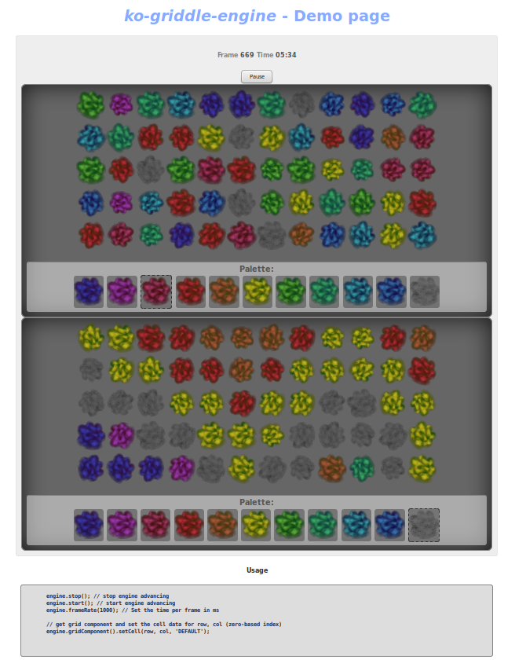

# ko-griddle-engine
**ko-griddle-engine** is a grid-based game engine for KnockoutJS (KO). It uses observables to render grid component. Templates are used for cell contents. Helper methods can be used to retreive an image based on the current item based on a lookup dictionary of tiles. Grid component contains editor functionality: palette of tiles, tile source lookup, edit by clicking cells to set selected tile.

Demo page included with 2 grids components in a single engine viewmodel.

# Current features
- EngineVM - viewmodel class for game engine
- start()/stop() API couples with frameRate() to track frames and timing
- afterAdvance() optional frame event handler to process game logic each frame
- gridComponent() - access grid component from EngineVM
- gridComponent().setCell(row, col, data) - set data for a cell in the grid

# Future development
- Separate grid component into subcomponents for editor functionality, palette
- Add tile animation api
- Add sprite rendering layer, using absolute position or transform:translate()
